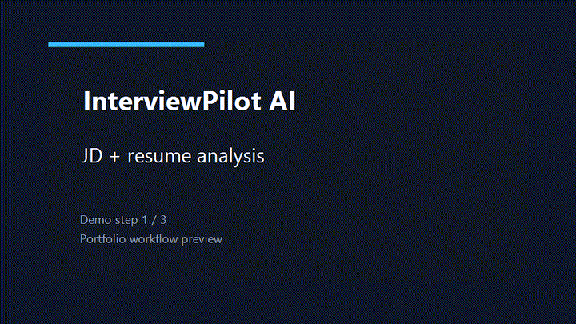

```mermaid
flowchart LR
  Candidate["Candidate"] --> Intake["JD + resume intake"]
  Intake --> Agents["Analyzer agents"]
  Agents --> Gap["Gap diagnosis"]
  Gap --> Planner["Interview planner"]
  Planner --> Session["Mock interview session"]
  Session --> Evaluator["Rubric evaluator"]
  Evaluator --> Report["Report + coaching plan"]
  Report --> Dashboard["Session history dashboard"]
```

# InterviewPilot AI

InterviewPilot AI is a candidate-facing AI mock interview coach for technical job seekers. It turns a target job description and a candidate resume into a focused practice loop:

`JD + resume -> structured analysis -> gap diagnosis -> mock interview -> rubric report -> coaching plan`

The MVP is designed for backend, full-stack, and AI application candidates who need targeted interview preparation rather than generic question lists. It is not a recruiter screening system and it does not make hiring decisions.

## 双语概览 / Bilingual Overview

| 中文 | English |
| --- | --- |
| 面向求职者的 AI 模拟面试教练，把目标 JD 和简历转成可练习的面试闭环。 | A candidate-facing AI mock interview coach that turns a target JD and resume into a focused practice loop. |
| 流程覆盖岗位分析、简历证据提取、差距诊断、模拟面试、评分报告和训练计划。 | The flow covers role analysis, resume evidence extraction, gap diagnosis, mock interview, rubric report, and coaching plan. |
| 产品边界是练习反馈，不做招聘筛选或录用决策。 | The product boundary is practice feedback, not recruiter screening or hiring decisions. |

## 架构 / Architecture



## 演示 GIF / Demo GIF



## 指标 / Portfolio Metrics

用于作品集展示的确定性 MVP baseline；切换外部 LLM 后，应按目标模型重新测试。

Deterministic MVP baseline for portfolio review. External LLM mode should be re-benchmarked with the target model before publishing production numbers.

| Metric | Current portfolio baseline | Measurement note |
| --- | ---: | --- |
| Latency | P50 API response target `< 800ms` | Local deterministic engine, single candidate flow |
| RAG hit rate | `N/A` | This MVP does not use vector retrieval |
| Agent success rate | `14/14 tests passing target` | Regression suite covers the candidate-facing agent loop |
| Report generation time | Target `< 5s` | Rubric report generated from session state, no PDF export |
| Cost | `$0` deterministic / model cost when enabled | Fallback engine is free; DashScope cost depends on selected model |

## Demo Highlights

- **Multi-Agent workflow:** JD Analyzer, Resume Analyzer, Gap Analysis, Resume Optimizer, Interview Planner, Interviewer, Evaluator, and Coach each own a clear product step.
- **Targeted analysis preview:** the user can see what the system understood about the role, resume evidence, matched skills, missing skills, weak evidence, and interview risks before starting.
- **Dynamic mock interview:** the text interview follows a section-based plan and can ask contextual follow-ups when answers are short, vague, or risky.
- **Structured report:** the final report includes six rubric dimensions, reasons for each score, strengths, weaknesses, risk flags, and next practice actions.
- **Candidate-safe boundaries:** resume suggestions improve truthful phrasing only, and scoring is framed as practice feedback rather than pass/fail judgment.

## Product Positioning

InterviewPilot AI helps candidates answer three practical preparation questions:

1. What is this target role likely to test?
2. Which parts of my resume are strong, missing, or weakly evidenced?
3. What should I practice next after one mock interview?

This positioning follows the PRD in [docs/PRD.md](docs/PRD.md): training value, explainability, graceful fallback, and user control come before broad feature coverage.

## Technical Highlights

- **FastAPI backend:** versioned API routes for JD intake, resume intake, analysis, interview sessions, reports, and dashboard history.
- **Strict Pydantic schemas:** prompt-aligned models reject unknown keys to keep agent outputs inspectable and prevent unsupported recruiter-side fields from entering the flow.
- **Prompt contract:** core business prompts use a versioned JSON-only contract for schema stability and future LLM integration.
- **MVP persistence:** local JSON store supports session and report回看 without overbuilding database abstractions.
- **No-build frontend:** lightweight vanilla JavaScript SPA with Dashboard, New Interview, Analysis Preview, Interview Session, and Report pages.
- **Regression coverage:** tests cover the full candidate-facing loop, API contracts, prompt quality rules, degraded input behavior, and report boundary language.

## Backend

Install dependencies:

```powershell
python -m pip install -e .
```

Start the API:

```powershell
python -m backend.app.main
```

Health check:

```powershell
Invoke-RestMethod http://127.0.0.1:8000/api/v1/health
```

### Optional: Alibaba Cloud Model Studio / DashScope LLM Test

The MVP runs without an external model by default. To test the agent prompts through Alibaba Cloud Model Studio's OpenAI-compatible endpoint, copy `.env.example` to `.env`, fill `INTERVIEWPILOT_LLM_API_KEY`, then start the backend:

```powershell
Copy-Item .env.example .env
notepad .env
python -m backend.app.main
```

Equivalent shell-only setup:

```powershell
$env:INTERVIEWPILOT_LLM_API_KEY="your-api-key"
$env:INTERVIEWPILOT_LLM_BASE_URL="https://dashscope.aliyuncs.com/compatible-mode/v1"
$env:INTERVIEWPILOT_LLM_MODEL="glm-5"
$env:INTERVIEWPILOT_LLM_ENABLED="true"
python -m backend.app.main
```

You can also use `DASHSCOPE_API_KEY` instead of `INTERVIEWPILOT_LLM_API_KEY`.

Do not commit API keys. If the model call fails, times out, or returns JSON that does not match the Pydantic schema, the backend falls back to the local deterministic MVP engine so the demo flow remains usable.

## Frontend

Start the MVP frontend:

```powershell
cd frontend
npm run dev
```

Open `http://127.0.0.1:5173`. The no-build SPA includes Dashboard, New Interview, Analysis Preview, Interview Session, and Report pages. By default it calls `http://127.0.0.1:8000/api/v1`; set `window.INTERVIEWPILOT_API_BASE` before loading the app if you need a different backend URL.

## Recommended Demo Flow

Use the default Backend API Engineer sample data in New Interview. It is intentionally shaped for a good demo: the resume has real FastAPI/PostgreSQL evidence, weak Redis/observability evidence, and limited ownership metrics. This lets the system show targeted gap analysis, section-based planning, dynamic follow-up, and a concrete coaching report.

Suggested screen sequence:

1. Dashboard: show the candidate-facing product promise and recent session history.
2. New Interview: show the JD/resume inputs and demo storyline.
3. Analysis Preview: show the Agent chain, JD understanding, resume evidence, gaps, risks, and interview plan.
4. Interview Session: answer one question briefly to trigger a follow-up, then end the interview.
5. Report: show rubric scores with reasons, weaknesses, risk flags, coaching actions, and next practice plan.

## Demo Runbook

For the end-to-end demo script, degraded-input check, product-boundary checklist, and data reset steps, see [docs/DEMO_RUNBOOK.md](docs/DEMO_RUNBOOK.md).

For a concise portfolio/interview pitch, screenshot plan, and talking points, see [docs/PORTFOLIO_BRIEF.md](docs/PORTFOLIO_BRIEF.md).
