# InterviewPilot AI

Language: **English** | [中文](README.zh-CN.md)

InterviewPilot AI is a candidate-facing mock interview coach for technical job seekers. It turns a target job description and a resume into a focused practice loop:

```text
JD + resume -> structured analysis -> gap diagnosis -> mock interview -> rubric report -> coaching plan
```

The MVP is designed for backend, full-stack, and AI application candidates who need targeted interview preparation rather than generic question lists. It does not make hiring decisions.

## Architecture

```mermaid
flowchart LR
  Candidate["Candidate"] --> Intake["JD + resume intake"]
  Intake --> Agents["Analyzer agents"]
  Agents --> Gap["Gap diagnosis"]
  Gap --> Planner["Interview planner"]
  Planner --> Session["Mock interview session"]
  Session --> Evaluator["Rubric evaluator"]
  Evaluator --> Report["Report + coaching plan"]
  Report --> Dashboard["Session history dashboard"]
```



## Demo GIF


## Portfolio Metrics

Deterministic MVP baseline for portfolio review. External LLM mode should be re-benchmarked with the target model before publishing production numbers.

| Metric | Current portfolio baseline | Measurement note |
| --- | ---: | --- |
| Latency | P50 API response target `< 800ms` | Local deterministic engine, single candidate flow |
| RAG hit rate | `N/A` | This MVP does not use vector retrieval |
| Agent success rate | `14/14 tests passing target` | Regression suite covers the candidate-facing agent loop |
| Report generation time | Target `< 5s` | Rubric report generated from session state |
| Cost | `$0` deterministic / model cost when enabled | Fallback engine is free; DashScope cost depends on selected model |

## Technical Highlights

- Multi-agent workflow: JD Analyzer, Resume Analyzer, Gap Analysis, Resume Optimizer, Interview Planner, Interviewer, Evaluator, and Coach.
- Strict Pydantic schemas and JSON-only prompt contracts.
- Candidate-safe boundaries: truthful resume suggestions and practice feedback, not pass/fail screening.
- Local deterministic fallback so the demo remains usable without an external LLM.
- Regression tests for API contracts, prompt quality, degraded input, session persistence, and reports.

## Run

Install dependencies:

```powershell
python -m pip install -e .
```

Start the API:

```powershell
python -m backend.app.main
```

Start the frontend:

```powershell
cd frontend
npm run dev
```

Open `http://127.0.0.1:5173`.

## Test

```powershell
python -m unittest discover -s tests
```
