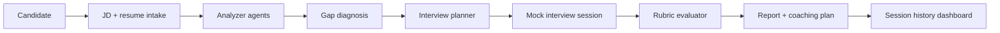

# InterviewPilot AI

Language: **English** | [中文](README.zh-CN.md)

InterviewPilot AI is a candidate-facing mock interview coach for technical job seekers. It turns a target job description and a resume into a focused practice loop:

```text
JD + resume -> structured analysis -> gap diagnosis -> mock interview -> rubric report -> coaching plan
```

The MVP is designed for backend, full-stack, and AI application candidates who need targeted interview preparation rather than generic question lists. It does not make hiring decisions.

## Architecture


```mermaid
flowchart LR
  Candidate["Candidate"] --> Intake["JD + resume intake"]
  Intake --> Agents["Analyzer agents"]
  Agents --> Gap["Gap diagnosis"]
  Gap --> Planner["Interview planner"]
  Planner --> Session["Mock interview session"]
  Session --> Evaluator["Rubric evaluator"]
  Evaluator --> Report["Report + coaching plan"]
  Report --> Dashboard["Session history dashboard"]
```

## Online Demo

- GitHub Pages static demo: `https://zifeiyuuuuuuu.github.io/InterviewPilot-AI/`
- The hosted demo keeps the candidate flow and portfolio preview. Real-model analysis, report generation, and local persistence still depend on the backend running locally or in private deployment.

## Real-Model Structured Eval

```powershell
python tests\real_model_eval.py
```

Current saved result file: `docs/real-model-eval.qwen-plus.json`

| Metric | Current measured result | Measurement note |
| --- | ---: | --- |
| Model | `qwen-plus` | DashScope compatible-mode |
| Success rate | `6/6 (100%)` | Covers JD analysis, resume analysis, gap diagnosis, resume optimization, interview planning, and report generation |
| Remote call count | `7` | Report generation uses two model calls (evaluator + coach) |
| Latency | P50 `12096.31ms`, P95 `54613.87ms` | Taken from `docs/real-model-eval.qwen-plus.json` |

## Local Regression Tests

```powershell
python -m unittest discover -s tests
```

Current local regression result: `48/48 passing`

## Technical Highlights

- Multi-agent workflow: JD Analyzer, Resume Analyzer, Gap Analysis, Resume Optimizer, Interview Planner, Interviewer, Evaluator, and Coach.
- Strict Pydantic schemas and JSON-only prompt contracts.
- Candidate-safe boundaries: truthful resume suggestions and practice feedback, not pass/fail screening.
- Local deterministic fallback so the demo remains usable without an external LLM.
- Regression tests for API contracts, prompt quality, degraded input, session persistence, and reports.

## Run

Install dependencies:

```powershell
python -m pip install -e .
```

Start the API:

```powershell
python -m backend.app.main
```

Start the frontend:

```powershell
cd frontend
npm run dev
```

Open `http://127.0.0.1:5173`.

## Test

```powershell
python -m unittest discover -s tests
```
