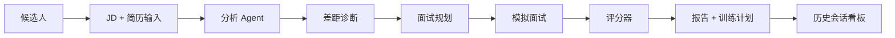

# InterviewPilot AI

语言： [English](README.md) | **中文**

InterviewPilot AI 是面向技术求职者的 AI 模拟面试教练。它把目标 JD 和候选人简历转成一个聚焦的练习闭环：

```text
JD + 简历 -> 结构化分析 -> 差距诊断 -> 模拟面试 -> 评分报告 -> 训练计划
```

MVP 面向后端、全栈和 AI 应用候选人，提供有针对性的面试准备，而不是通用题库。它不做招聘筛选或录用决策。

## 架构



## 演示 GIF


## 作品集指标

用于作品集展示的确定性 MVP baseline；切换外部 LLM 后，应按目标模型重新测试。

| 指标 | 当前作品集 baseline | 说明 |
| --- | ---: | --- |
| 延迟 | API 响应 P50 目标 `< 800ms` | 本地确定性引擎，单候选人流程 |
| RAG 命中率 | `N/A` | MVP 不使用向量检索 |
| Agent 成功率 | `14/14 tests passing target` | 回归测试覆盖候选人侧 Agent 闭环 |
| 报告生成耗时 | 目标 `< 5s` | 基于会话状态生成评分报告 |
| 成本 | 确定性模式 `$0` / 启用模型后按模型计费 | fallback 引擎免费；DashScope 成本取决于模型 |

## 技术亮点

- 多 Agent 工作流：JD 分析、简历分析、差距诊断、简历优化、面试规划、面试官、评估器和教练。
- 严格 Pydantic schema 和 JSON-only prompt contract。
- 候选人安全边界：只做真实表达优化和练习反馈，不做通过/淘汰判断。
- 本地确定性 fallback，外部 LLM 不可用时 demo 仍可运行。
- 回归测试覆盖 API contract、prompt 质量、降级输入、会话持久化和报告。

## 运行

安装依赖：

```powershell
python -m pip install -e .
```

启动 API：

```powershell
python -m backend.app.main
```

启动前端：

```powershell
cd frontend
npm run dev
```

打开 `http://127.0.0.1:5173`。

## 测试

```powershell
python -m unittest discover -s tests
```
