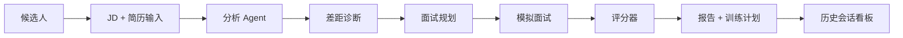

# InterviewPilot AI

语言： [English](README.md) | **中文**

InterviewPilot AI 是面向技术求职者的 AI 模拟面试教练。它把目标 JD 和候选人简历转成一个聚焦的练习闭环：

```text
JD + 简历 -> 结构化分析 -> 差距诊断 -> 模拟面试 -> 评分报告 -> 训练计划
```

MVP 面向后端、全栈和 AI 应用候选人，提供有针对性的面试准备，而不是通用题库。它不做招聘筛选或录用决策。

## 架构


```mermaid
flowchart LR
  Candidate["候选人"] --> Intake["JD + 简历输入"]
  Intake --> Agents["分析 Agent"]
  Agents --> Gap["差距诊断"]
  Gap --> Planner["面试规划"]
  Planner --> Session["模拟面试"]
  Session --> Evaluator["评分器"]
  Evaluator --> Report["报告 + 训练计划"]
  Report --> Dashboard["历史会话看板"]
```

## 线上演示

- GitHub Pages 静态演示：`https://zifeiyuuuuuuu.github.io/InterviewPilot-AI/`
- 线上演示保留候选人流程和静态作品集展示；真实模型分析、报告生成和本地持久化以本地后端运行为准。

## 真实模型结构化评测

```powershell
python tests\real_model_eval.py
```

当前已落盘结果：`docs/real-model-eval.qwen-plus.json`

| 指标 | 当前实测结果 | 说明 |
| --- | ---: | --- |
| 模型 | `qwen-plus` | DashScope compatible-mode |
| 成功率 | `6/6 (100%)` | 覆盖 JD 分析、简历分析、差距诊断、简历优化、面试规划、报告生成 |
| 模型调用次数 | `7` | 报告生成阶段包含评估器和教练 2 次调用 |
| 延迟 | P50 `12096.31ms`, P95 `54613.87ms` | 取自 `docs/real-model-eval.qwen-plus.json` |

## 本地回归测试

```powershell
python -m unittest discover -s tests
```

当前本地回归测试结果：`48/48 passing`

## 技术亮点

- 多 Agent 工作流：JD 分析、简历分析、差距诊断、简历优化、面试规划、面试官、评估器和教练。
- 严格 Pydantic schema 和 JSON-only prompt contract。
- 候选人安全边界：只做真实表达优化和练习反馈，不做通过/淘汰判断。
- 本地确定性 fallback，外部 LLM 不可用时 demo 仍可运行。
- 回归测试覆盖 API contract、prompt 质量、降级输入、会话持久化和报告。

## 运行

安装依赖：

```powershell
python -m pip install -e .
```

启动 API：

```powershell
python -m backend.app.main
```

启动前端：

```powershell
cd frontend
npm run dev
```

打开 `http://127.0.0.1:5173`。

## 测试

```powershell
python -m unittest discover -s tests
```
